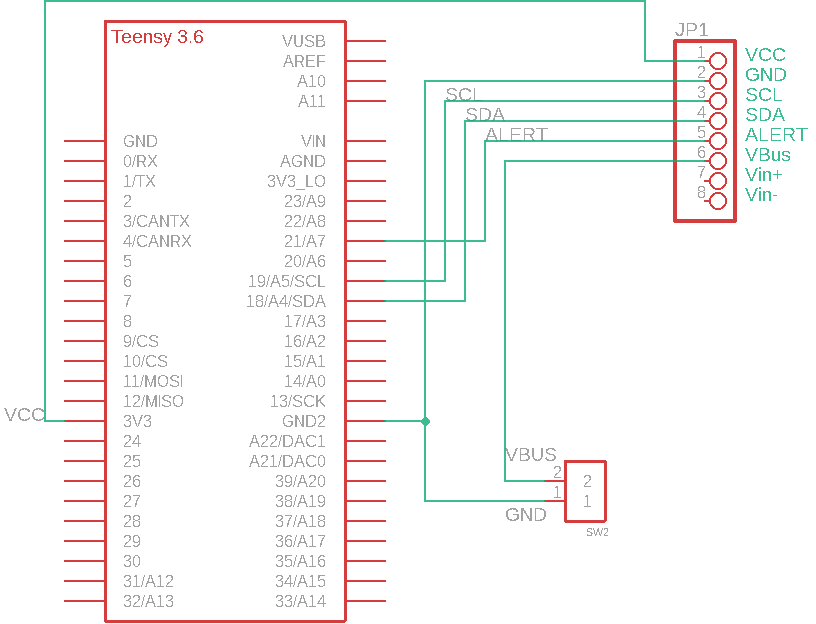

# PowerProf Hardware Resources

## Schematics

### Teensy Version

### Wemos D1 mini Version

## Boards

### Teensy Version

### Wemos D1 mini Version

## BOMs

### Teensy Version

| Mfg      | Name       | Qty | Buy                                                                                                           |
| -------- | ---------- | --- | ------------------------------------------------------------------------------------------------------------- |
| PJRC     | Teensy 3.6 | 1   | [Link](https://www.pjrc.com/store/teensy36.html)                                                              |
| Adafruit | 4226       | 1   | [Link](https://www.mouser.com/ProductDetail/Adafruit/4226?qs=PzGy0jfpSMvb8foRR1BpJA%3D%3D)                    |
| TE Conn. | 282834-2   | 1   | [Link](https://www.mouser.com/ProductDetail/TE-Connectivity/282834-2?qs=A%252Bip%252BNCYi6N8cVKuk8xDog%3D%3D) |

### Wemos D1 mini Version

| Mfg      | Name       | Qty | Buy                                                                                                           |
| -------- | ---------- | --- | ------------------------------------------------------------------------------------------------------------- |
| Wemos    | Teensy 3.6 | 1   | [Link](https://www.wemos.cc/en/latest/d1/d1_mini.html)                                                        |
| Adafruit | 4226       | 1   | [Link](https://www.mouser.com/ProductDetail/Adafruit/4226?qs=PzGy0jfpSMvb8foRR1BpJA%3D%3D)                    |
| TE Conn. | 282834-2   | 1   | [Link](https://www.mouser.com/ProductDetail/TE-Connectivity/282834-2?qs=A%252Bip%252BNCYi6N8cVKuk8xDog%3D%3D) |
