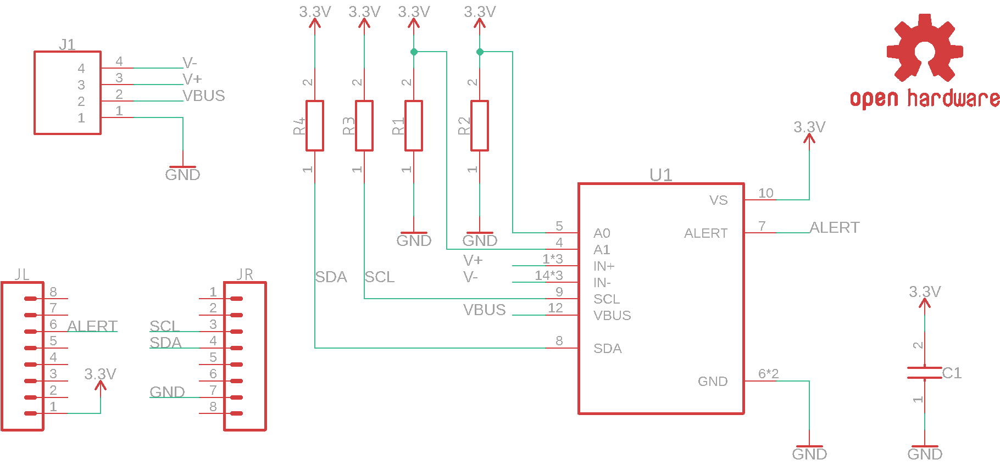
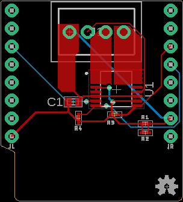

# PowerProf Hardware Resources

PowerProf is a current monitor for embedded systems. You can use it to get accurate current consumption data for any workload or operating conditions, and then use that information to design battery-based systems with just the right amount of capacity.

There are currently two supported microcontrollers - the Teensy 3.6 and the Wemos D1 Mini. The Teensy version supports communication over USB, while the Wemos D1 Mini supports USB and WiFi. Both boards use the [INA260 current sensor](https://www.ti.com/lit/ds/symlink/ina260.pdf) from Texas Instruments. There are two variants of the Wemos D1 Mini board - one uses the INA260 breakout board from Adafruit, and the other uses an INA260 directly.

## Specifications

| Name                | Absolute         | Typical      |
| ------------------- | ---------------- | ------------ |
| Measurement Voltage | -0.3V - 40V      | 0 - 36V      |
| Measurement Current | 0 - 15A          | 0 - 10A      |
| Voltage Resolution  | 1.25mV           |              |
| Current Resolution  | 1.25mA           |              |
| Power Resolution    | 10mW             |              |
| Sample Rate         | 110Hz - 6.494kHz | 110Hz - 1kHz |
| Supply Voltage      | 5V               | 5V           |
| Supply Current      | 30-500mA         | 100mA        |

## Wiring Diagrams

## Teensy

The Teensy board is a carrier board which houses the microcontroller and the INA260 current sensor.

[Order this board from OSH Park](https://oshpark.com/shared_projects/RvujZ5At)

### Schematic

### Board

### BOM

| Mfg      | Name                | Qty | Buy                                                                                                           |
| -------- | ------------------- | --- | ------------------------------------------------------------------------------------------------------------- |
| PJRC     | Teensy 3.6          | 1   | [Link](https://www.pjrc.com/store/teensy36.html)                                                              |
| Adafruit | INA260 Breakout     | 1   | [Link](https://www.mouser.com/ProductDetail/Adafruit/4226?qs=PzGy0jfpSMvb8foRR1BpJA%3D%3D)                    |
| TE Conn. | 282834-2            | 1   | [Link](https://www.mouser.com/ProductDetail/TE-Connectivity/282834-2?qs=A%252Bip%252BNCYi6N8cVKuk8xDog%3D%3D) |
| DuPont   | 8-pin 2.54mm Header | 1   |                                                                                                               |

### Assembly

1. Solder the Teensy to the top side of the board.
2. Solder the 8-pin header to the top side of the board.
3. Solder the INA260 to the 8-pin header.
4. Solder the terminal block to the top side of the board.

## Wemos D1 Mini

### r1 - INA260 Breakout

This board is a "shield" for the D1 Mini which has an INA260 breakout board mounted on it.

[Order this board from OSH Park](https://oshpark.com/shared_projects/oW7e4EAU)

#### Schematic

#### Board

#### BOM

| Mfg      | Name                            | Qty | Buy                                                                                        |
| -------- | ------------------------------- | --- | ------------------------------------------------------------------------------------------ |
| Wemos    | D1 Mini                         | 1   | [Link](https://www.wemos.cc/en/latest/d1/d1_mini.html)                                     |
| Adafruit | INA260 Breakout                 | 1   | [Link](https://www.mouser.com/ProductDetail/Adafruit/4226?qs=PzGy0jfpSMvb8foRR1BpJA%3D%3D) |
| DuPont   | 8-pin 2.54mm Header             | 2   |                                                                                            |
| DuPont   | 6-pin 2.54mm Header             | 1   |                                                                                            |
| DuPont   | 2-pin Right Angle 2.54mm Header | 1   |                                                                                            |

#### Assembly

1. Solder the two 8-pin headers on the underside of the board.
2. Solder the 6-pin header to the top side of the board.
3. Solder the 2-pin right angle header to the top side of the board.
4. Solder the INA260 to the 6-pin header - make sure that V+/V- pins of the INA260 breakout are not connected!
5. Install the shield on top of a D1 Mini.

### r2 - INA260 Onboard

This board is a "shield" for the D1 Mini which has an INA260 directly soldered to it.

[Order this board from OSH Park](https://oshpark.com/shared_projects/kBgNvwmK)

#### Schematic

#### Board

#### BOM

| Mfg      | Name                | Qty | Buy                                                                                        |
| -------- | ------------------- | --- | ------------------------------------------------------------------------------------------ |
| Wemos    | D1 Mini             | 1   | [Link](https://www.wemos.cc/en/latest/d1/d1_mini.html)                                     |
| Adafruit | INA260 Breakout     | 1   | [Link](https://www.mouser.com/ProductDetail/Adafruit/4226?qs=PzGy0jfpSMvb8foRR1BpJA%3D%3D) |
| DuPont   | 8-pin 2.54mm Header | 2   |                                                                                            |
| TI       | INA260AIPWR         | 1   | [Link](https://www.mouser.com/ProductDetail/595-INA260AIPWR)                               |
| Yageo    | RT1206FRE0710KL     | 2   | [Link](https://www.mouser.com/ProductDetail/603-RT1206FRE0710KL)                           |
| Samsung  | CL31B104KBCNNNL     | 1   | [Link](https://www.mouser.com/ProductDetail/187-CL31B104KBCNNNL)                           |

#### Assembly

1. Solder the INA260 and the SMD resistors/capacitor to the top side of the board.
2. Solder the two 8-pin headers to the underside of the board.
3. Solder the 4-pin terminal block to the top side of the board.
4. Install the shield on top of a D1 Mini.

## Roadmap

Some things we'd like to add, given the time:

- An ESP32-based board with Bluetooth communication
- One modular connector for the front-end instead of four separate wires

## Acknowledgements

Special thanks to [weeding-nerdy](https://github.com/weeding-nerdy) for their [gufu_gud](https://github.com/weeding-nerdy/gufu_gud), which was the inspiration for this project.
